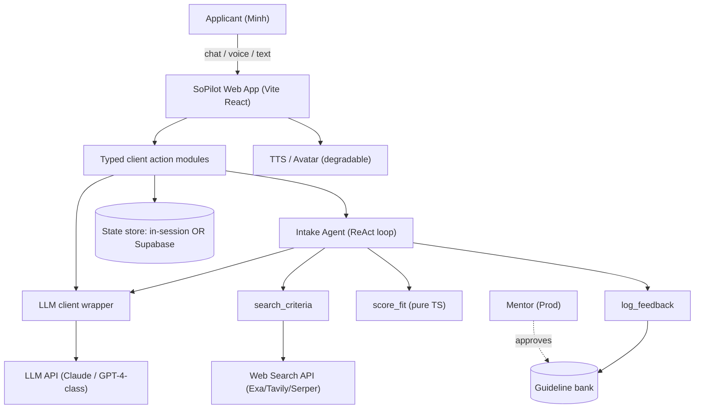
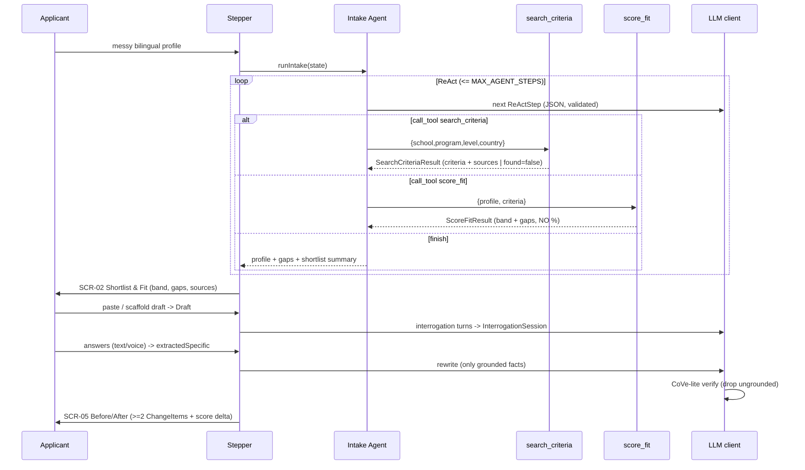
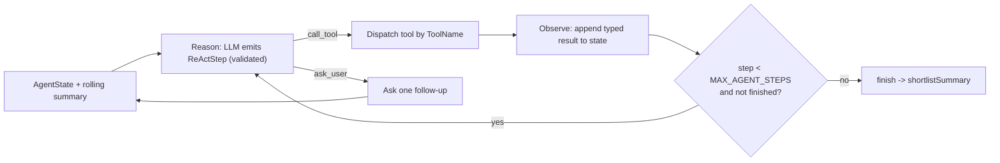
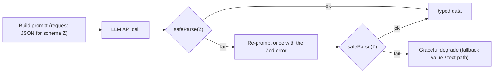

# ARCHITECTURE.md — SoPilot Technical Architecture

> **Authority order:** `contracts.ts` > `AGENTS.md` > `PRD.md` > this doc. This describes HOW the system is built; it must not contradict the locked shapes/rules above.
> **Audience:** the coding agent + the 1–2 devs. **Scope:** the 24h MVP P0 path. Production-only elements are marked **[Prod]** and must not be built now.

---

## 1. System context

Only one external dependency is on the demo critical path that we don't control fully: the LLM API. Search and TTS are critical-path-adjacent and must degrade (§8).

## 2. Component responsibilities
| Component | Path | Responsibility | Must NOT |
|-----------|------|----------------|----------|
| Web App (Stepper) | `/src` | Render 5 P0 screens as a single-page state machine; hold `AgentState`. | Add routing per screen, add a state lib. |
| Action layer | `/src/lib/actions.ts` | Expose the actions in `API_SPEC.md`; orchestrate agent + tools in typed client modules. | Become a separate service. |
| Intake Agent | `/src/lib/agent` | ReAct loop: emit `ReActStep`, dispatch tools, bounded by `MAX_AGENT_STEPS`. | Produce facts or scores itself. |
| Tools | `/src/lib/tools` | `search_criteria.ts`, `score_fit.ts`, `log_feedback.ts` — match `contracts.ts` signatures. | Exceed three tools. |
| LLM client | `/src/lib/llm` | One wrapper: structured-output request → Zod validate → repair-once → degrade. | Be called directly without validation. |
| Memory | `/src/lib/memory` | `AgentState` read/write + rolling summarization. | Add vector memory. |
| Contracts | `/src/lib/contracts.ts` | Re-export `contracts.ts`. | Redefine shapes. |

## 3. Folder structure (authoritative)
```
/src
  App.tsx                  # Stepper host: switches on ST_* state
  /components              # ChatIntake, ShortlistFit, DraftWorkspace, Interrogation, BeforeAfter
  /lib
    /actions.ts            # typed action modules (see API_SPEC.md)
    /agent/loop.ts         # ReAct loop + step dispatch
    /agent/system.ts       # builds system prompt (base + injected guidelines)
    /tools/search_criteria.ts
    /tools/score_fit.ts    # deterministic; NO LLM
    /tools/log_feedback.ts
    /llm/client.ts         # callStructured(schema, prompt) -> validated T
    /llm/verify.ts         # CoVe-lite pass
    /memory/state.ts       # AgentState helpers + rolling summary
    /contracts.ts          # re-export docs/contracts.ts
```

## 4. Happy-path data flow (full P0 flow)


## 5. ReAct loop (internal)

Rules: one tool per step; every step validated via `validateLlmOutput(zReActStep, …)`; on validation failure, repair-once then `ask_user` fallback. Never loop past `MAX_AGENT_STEPS`.

## 6. LLM call + validation pipeline (every structured call)

Implemented once in `/lib/llm/client.ts` as `callStructured(schema, prompt)`. Nothing else calls the LLM directly.

## 7. Anti-hallucination guard placement (where each REQ lives)
- **REQ-651** facts: only `search_criteria` writes `Criterion.requirement`/`sourceUrl`. The agent prompt forbids stating unsourced criteria.
- **REQ-652** scores: only `/lib/tools/score_fit.ts` (pure TS) produces `FitBand`. The LLM is given the computed result to *explain*, never to compute. There is no number field the LLM can fill.
- **REQ-653** structure: `callStructured` is the only LLM entrypoint; all output is schema-validated.
- **REQ-654** verify: `/lib/llm/verify.ts` runs before SCR-05; produces `VerifiedClaim[]`; `groundedIn==="none"` ⇒ removed/flagged.
- **REQ-655** abstention: prompts explicitly allow "I couldn't verify this"; `SearchCriteriaResult.found===false` short-circuits to abstain.

## 8. Degradation matrix (REQ-701 — nothing crashes the demo)
| Failure | Detection | Fallback |
|---------|-----------|----------|
| LLM timeout/error | try/catch in `callStructured` | repair-once → partial result / "continue with what we have" |
| Malformed JSON | Zod safeParse fails | re-prompt once → degrade |
| `search_criteria` empty/down | `found===false` or throw | agent abstains; fit shows `insufficient_data` band |
| TTS/avatar fails | promise reject / flag | text-only interrogator (content identical) |
| Real-time avatar (`AVATAR_REALTIME`) | flag, off by default | animated face + TTS |
| Network/API outage at demo | n/a | **pre-recorded backup video (REQ-702)** |

## 9. State & memory model
- One `AgentState` object is the working memory and the canonical truth (`PRD §4`, `REQ-706`).
- Persistence: **pick one** — in-session React state (fastest, demo-safe) OR Supabase row keyed by a demo session id. Do not build both.
- Long chats: `/lib/memory` summarizes older turns into `rollingSummary`; the structured fields stay authoritative.
- **No cross-session vector memory.** [Prod] would add Supabase pgvector.

## 10. Key technical decisions (and rejected alternatives)
| Decision | Choice | Why | Rejected |
|----------|--------|-----|----------|
| App shape | Single-page Stepper | No routing overhead; demo never "dead-navigates" | Multi-route app |
| Action layer | Vite client-side action modules | One codebase, one dev moves fast | Separate API service |
| Fit scoring | Deterministic TS rubric | Honest, explainable, un-hallucinatable | LLM-generated % |
| Grounding | Hosted search + citations | Buildable in minutes; sources kill hallucination | Self-hosted RAG/vector DB |
| Learning | Mentor-gated guideline injection | Real "improves from feedback", human-safe | Federated learning / self-rewrite |
| Memory | State object + rolling summary | Cheap, reliable, in-budget | Vector memory store |
| Avatar | TTS + light animation | 90% wow, 10% risk | Real-time talking head on critical path |
| Validation | Zod on every LLM output | Machine-enforced correctness | Trusting raw model JSON |

## 11. Security & privacy (MVP-level)
Secrets via env only (`AGENTS.md §11`). No PII in logs. `log_feedback` stores anonymized context only. No data sold; minimal retention. [Prod]: proper auth, encryption at rest, data-retention policy.

## 12. Architectural non-goals (do not build)
Microservices, queues, Docker orchestration, GraphQL, ORM, state-management lib, custom design system, multi-tenant isolation, vector DB, model training/fine-tuning. (Mirror of `AGENTS.md §6`.)
